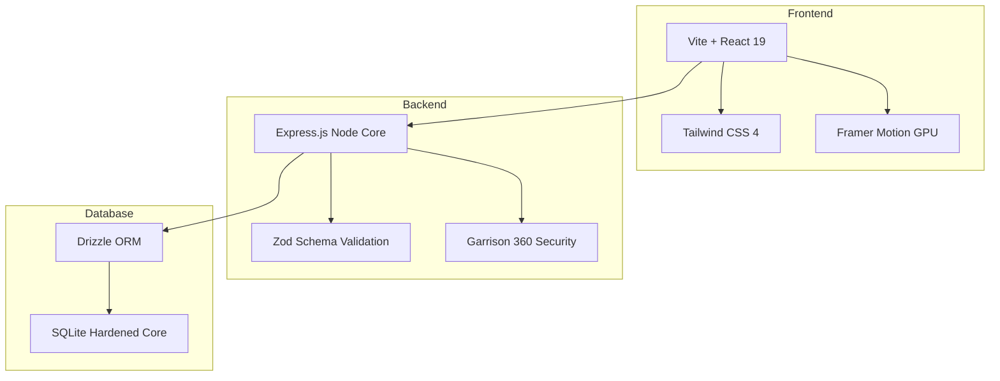
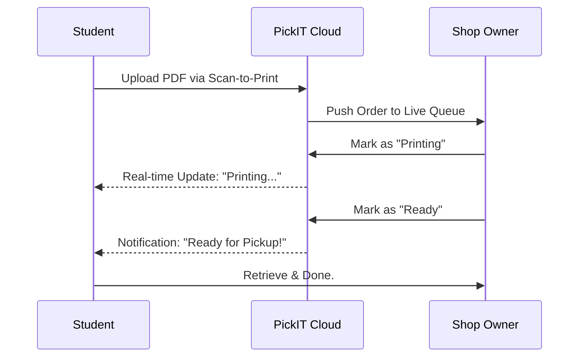

# PickIT 🚀
### Disrupting Campus Logistics. One Print at a Time.

<div align="center">


[](https://github.com/VENKATAVISHALKOVURU/PickIT-new/stargazers)
[](SECURITY.md)
[](https://github.com/VENKATAVISHALKOVURU/PickIT-new)
[](https://github.com/VENKATAVISHALKOVURU/PickIT-new)

**Built by [VENKATA VISHAL KOVURU](https://github.com/VENKATAVISHALKOVURU)**

[Explore Docs]() · [Report Bug](https://github.com/VENKATAVISHALKOVURU/PickIT-new/issues) · [Request Feature](https://github.com/VENKATAVISHALKOVURU/PickIT-new/issues)

</div>

---

## 🌪️ The Problem: Campus Printing Chaos
Every day, thousands of students waste millions of hours in printing queues. USB drives spread malware, email attachments get lost, and manual payment tracking is a nightmare for shop owners.

**PickIT is the solution.** We provide a high-speed, secure, and seamless bridge between student files and shop printers.

---

## ⚡ God-Mode Smoothness
PickIT isn't just another web app. It's an **experience**.
- **GPU-Accelerated**: 60 FPS animations on every device.
- **Hardware-Accelerated Layouts**: 0ms layout thrashing.
- **Micro-Interactions**: Haptic-style visual feedback on every click.

---

## 🏗️ Technical Architecture
A modern **Turbo-powered Monorepo** designed for massive scale.



---

## 🚀 The Student Journey



---

## 🛡️ The Garrison 360 Security Framework
We treat student data like sovereign gold.
- **Zero-Day Recon**: Proactive scanning for RCE and XSS vulnerabilities.
- **Vault Hardening**: OS-level ACLs for database protection.
- **IDOR Neutralization**: Cryptographic ownership verification.

---

## 🛠️ Installation & Setup

1. **Clone & Install**
   ```bash
   git clone https://github.com/VENKATAVISHALKOVURU/PickIT-new.git
   pnpm install
   ```

2. **Fortify & Launch**
   ```bash
   pnpm db:push
   powershell -File scripts/harden-db-permissions.ps1
   pnpm dev
   ```

---

## 🌟 Support the Project
If PickIT is helping your campus, please **give us a star on GitHub!** It helps the project grow and reach more students worldwide.

---

<div align="center">
  Developed with ❤️ by <b>VENKATA VISHAL KOVURU</b> <br/>
  <b>Req · Ready · Retrieve</b>
</div>
