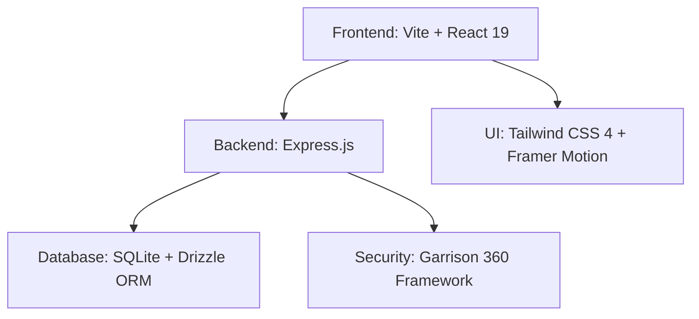

# PickIT 🚀
### Queue-Free Campus Printing. Revolutionized.

[](SECURITY.md)
[](LICENSE)
[](https://github.com/leela-pickit/pickit)

---

## 🌪️ The Vision
PickIT is disrupting the archaic campus printing experience. We eliminate the "Printing Chaos"—the long lines, USB drive infections, and manual payment tracking. 

**Our Mission:** To provide students with instantaneous, secure, and remote printing access while empowering shop owners with an elite business management dashboard.

---

## ✨ Features

### 🛡️ For Students
- **Zero-Queue Printing**: Upload PDFs from your dorm, your cafe, or your class.
- **Scan-to-Print**: Direct connection to campus shops via QR code.
- **Live Tracking**: Real-time status updates from "Pending" to "Picked Up."
- **Secure Vault**: End-to-end encrypted file submission.

### 📈 For Shop Owners
- **Command Center**: Manage high-volume print queues with ease.
- **Dynamic Pricing**: Intelligent control over B/W vs Color vs A3 pricing.
- **Revenue Analytics**: Daily, weekly, and monthly growth insights.
- **Garrison Security**: Built-in protection against IDOR, XSS, and SQL Injection.

---

## 🏗️ Technical Architecture
PickIT is built as a high-performance **Turbo-powered Monorepo** using the modern **MERN + Drizzle** stack.



### Core Technologies
- **Frontend**: React 19, Tailwind CSS 4, Framer Motion (GPU-Accelerated).
- **Backend**: Node.js, Express, Zod (Schema Validation).
- **Database**: SQLite (local-first performance) with Drizzle ORM.
- **Security**: Helmet, Rate Limiting, ACL-based file hardening.

---

## 🛠️ Getting Started

### Prerequisites
- Node.js v18+
- pnpm (Recommended)

### Installation
1. **Clone the repository:**
   ```bash
   git clone https://github.com/leela-pickit/pickit.git
   cd pickit
   ```

2. **Install dependencies:**
   ```bash
   pnpm install
   ```

3. **Initialize the Data Vault:**
   ```bash
   pnpm db:push
   powershell -File scripts/harden-db-permissions.ps1
   ```

4. **Launch the Garrison:**
   ```bash
   pnpm dev
   ```

---

## 🛡️ Security
Security is not an afterthought; it is our foundation. PickIT is fortified with the **Garrison 360 Framework**, featuring:
- **Zero-Day Reconnaissance**: Continuous monitoring for RCE and XSS.
- **Vault Hardening**: Restricted file-system access for the data core.
- **IDOR Neutralization**: Strict ownership verification for every transaction.

*Read more in [SECURITY.md](SECURITY.md).*

---

## 📜 License
PickIT is released under the [MIT License](LICENSE).

---

<p align="center">
  Built with ❤️ for the global student community. <br/>
  <b>Req · Ready · Retrieve</b>
</p>
